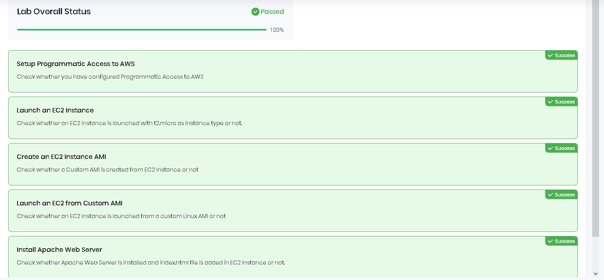

I had concern about the course being tied to AWS infrastructure but I reminded myself that
the concepts are basically almost the same 
As they say with one bullet two rabbits, I can't wait to absorb new knowledge but at the same time
I gotta do it in timely manner since my day-to-day job is quite "CPU" demanding as well.

--
22.12.2024

First lab, preparing for Terraform Associate Exam

And since I allocated time as well to learn Terraform and K8s, I opened up
my Virtual Box, with Bridge Connection as networking Option one of my Kali Linux VMs
about to install docker and other dependencies and see if I will still face issues, as I did
on my Host OS which is Windows

# Installing Docker

sudo apt update && sudo apt install docker.io -y

# Ensure Docker is running

sudo systemctl start docker
sudo systemctl enable docker
docker --version

Worth mentioning I allocated 11 RAM for the machine to ensure it has the needed requirements for running 
docker and k8s

# Installing Kubernetes tools (kubectl, kubeadm, kubelet)

sudo apt-get update
sudo apt-get install -y apt-transport-https ca-certificates curl

Download the GPG key and save it to /usr/share/keyrings:
sudo curl -fsSLo /usr/share/keyrings/kubernetes-archive-keyring.gpg https://packages.cloud.google.com/apt/doc/apt-key.gpg

Add the Kubernetes repository to your system:
echo "deb [signed-by=/usr/share/keyrings/kubernetes-archive-keyring.gpg] https://apt.kubernetes.io/ kubernetes-xenial main" | sudo tee /etc/apt/sources.list.d/kubernetes.list

*yes I got navigated by ChatGPT for some of the commands since long time no see Linux CLI..*

Since when trying to install k8s tools they can not find the repo , had to re-add the repository and confirm it:
echo "deb [signed-by=/usr/share/keyrings/kubernetes-archive-keyring.gpg] https://apt.kubernetes.io/ kubernetes-xenial main" | sudo tee /etc/apt/sources.list.d/kubernetes.list

Also ensure the GPG Key is properly installed
sudo curl -fsSLo /usr/share/keyrings/kubernetes-archive-keyring.gpg https://packages.cloud.google.com/apt/doc/apt-key.gpg

and finally update my package cache 
sudo apt-get update

Which got the output 

Hit:1 http://http.kali.org/kali kali-rolling InRelease
Ign:4 https://download.docker.com/linux/debian kali-rolling InRelease
Err:5 https://download.docker.com/linux/debian kali-rolling Release
  404  Not Found [IP: 18.165.61.84 443]
Hit:2 https://packages.microsoft.com/repos/code stable InRelease
Ign:3 https://packages.cloud.google.com/apt kubernetes-xenial InRelease
Err:6 https://packages.cloud.google.com/apt kubernetes-xenial Release
  404  Not Found [IP: 142.251.140.14 443]
Reading package lists... Done
E: The repository 'https://download.docker.com/linux/debian kali-rolling Release' does not have a Release file.
N: Updating from such a repository can't be done securely, and is therefore disabled by default.
N: See apt-secure(8) manpage for repository creation and user configuration details.
E: The repository 'https://apt.kubernetes.io kubernetes-xenial Release' does not have a Release file.
N: Updating from such a repository can't be done securely, and is therefore disabled by default.
N: See apt-secure(8) manpage for repository creation and user configuration details.

After researching it appears that Docker repository does not have a kalli-rolling release file, but I can use the bullseye Debian 11
sudo nano /etc/apt/sources.list.d/docker.list

replaced it with
deb [arch=amd64] https://download.docker.com/linux/debian bullseye stable

Update the GPG Key for Docker: Download and add the GPG key for Docker:
sudo mkdir -p /etc/apt/keyrings

curl -fsSL https://download.docker.com/linux/debian/gpg | sudo gpg --dearmor -o /etc/apt/keyrings/docker.gpg

Again try To Update the Package cache
sudo apt-get update

Since it is getting again quite late I will try again when I have free time

Options that I see:
[ ] Try to troubleshoot and run docker and k8s on kali linux
[ ] Quickly Deploy linux distro and version that can run seemlessly those two

---

23.12.2024
My Terraform study journey

Today I learned that when you run terraform init it downloads the required providers that are specified at main.tf, but
if that provider is not developed by Hashicorp, but 3rd party, you *must* specify the needed settings that you will find in the documentation section
of that provider (for Example Digital Ocean)

After that I downloaded the usage code for Github provider, then when in the Github settings >> Developer Settings
>>Personal Access Tokens

I generated new token and added it in the argument sections of the github provider giving just access to repo and repo delete operations
Later I added the github_repository resource 
I specified name and visibility to private of the repo that I will create.
Then `terraform init`
it downloaded the necessary provider.

`terraform plan` it validated my settup and downloaded the lock

So what I did is created github repo using terraform and Personal Access Token with basic
permissions that give terraform, I faced issues while following the tutorial, after a bit
of research the issue that I was facing was because in the tutorial they were using the resource with template,
which you got by default when creating github account and since my account is old I may have deleted it, thus the output was with 404 error.
I deleted the refference as using template and created a public repo.
Finally I deleted the created resource with `terraform destroy`
One thing that I could have done better is not hardcoding the PAT but rather having seperate module with variables.
Other good consideration is having only appropriate permissions for specific time granted.
Which reminds me to go and delete the PAT (just in case, even that it is valid for 7 days)

---
24.12.2024
# Provider versioning, the loc file, specifying concrete versions 
Today starts of with learning about provider versioning.

So after having sample code that refferences the required aws provider version to be greater than 3
and running `terraform init`

I can see

Even though that when going into the `use provider` section of AWS the specified in code version is :

This happens because my terraform is older version itself.

Now trying to change the version to 2.0

Got this error:

In order to fix that the .lock file must be removed.
Because once that file is created it will adhere to that specification (dependencies and stuff)
:

Now even trying a version that is between two versions, of course  before running `terraform init` 
I make sure I deleted the lock file.

Also looking at the hidden folder we can see how terraform keeps track of different versions that we downloaded:
 

 
Now made the version to be ~> 3.0
and got this output, this time I didn't deleted the lock file
 

But the tutorial that I follow mentions such scenarios and dealing with such situations first by deleting the lock file just as we did up until now and the other one is with 
  
`terraform init -upgrade`

It's basically a command that ignores what is in the lock file and creates from fresh

# Terrafrom state
Terraform keeps a state file of every resource created  in `terraform.tfstate` 
The state file is like a mapping / bridging between your local computer and the resource. Everytime we `apply` or `plan` it will refresh the state.  
It can be configured to be stored <b>locally</b> or <b>remotely</b> for example in Azure Blob Storage
If we delete the state file when we run 
`terraform plan`
  
the local machine has no idea about the remote  and it will show it has to create resources
if we then hit 
`terraform apply`
  
It will try to create them, it will see these resources are already created with the same name and it will say that there are resources with the same name  
<b>[ ! ]</b>  We should not change the state file 
<b>[ ! ]</b>  We should not change the resource from other place than terraform 
<b>[ ! ]</b>  The moment we run `terraform destroy` for something that is outside of sync it will not be deleted!

  
When there is a mistmatch from the Portal of the cloud and the terraform state file
we can see it by running  
`terraform refresh`

It will cross-check the local state vs the remote state nnd it will update with the latest state

If from the Cloud Portal we change the configuration of hte virtual machine the current state and desired state will have difference

`terraform refresh`
It will fetch the current state   
`terraform plan`
It will show the changes   
`terraform apply`   
It will apply to adhere to the desired state

Desired State --> what we mention in the configuration file  
Actual / Current State --> the actual state of the resource at that particular moment

# Attributes

During the apply phase, terraform outputs the attributes of the resources.The output can be assigned to a resource

For example when creating EC2 instance the Elastic IP can be assigned / passed to Security Group

---
26.12.2024  
Today's lab is    <h1> Host a S3 Static Website using Terraform</h1>

<b>Architecture Diagram</b>  

<h1>Steps taken:</h1>

Created a `variables.tf` in which I have the following:

  
 