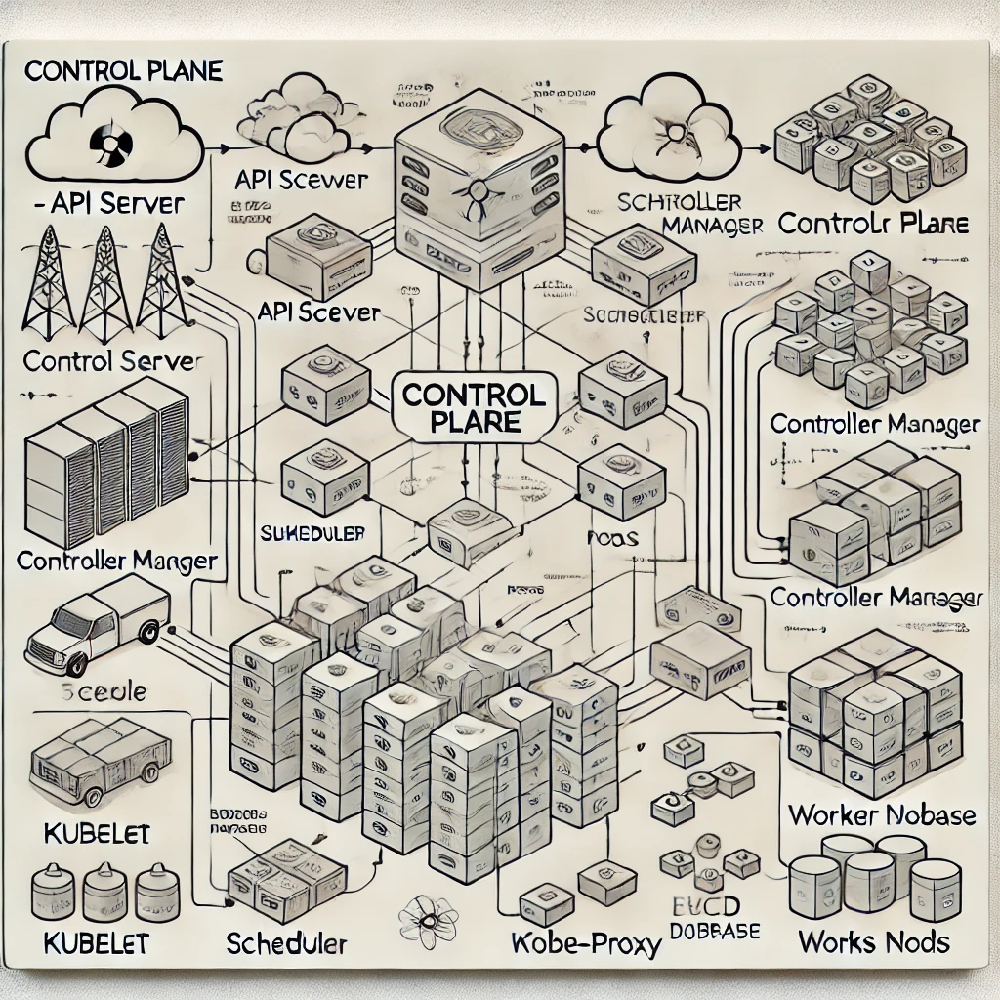

### Kubernetes Learning Guide for Playgrounds

#### 1. **What is Kubernetes?**
Kubernetes (K8s) is an open-source platform for container orchestration. It allows you to deploy, scale, and manage containerized applications.

#### 2. **Basic Concepts in Kubernetes:**
- **Pods**: Smallest deployable unit. Contains one or more containers.
- **Nodes**: Worker machines where containers run.
- **Deployments**: Describes desired state of your application.
- **Services**: Expose your application (ClusterIP, NodePort, LoadBalancer).
- **Namespaces**: Logical separation of resources in a cluster.

#### 3. **Basic kubectl Commands:**
1. **Check Cluster Status:**
   ```bash
   kubectl get nodes
   ```

2. **Create a Deployment:**
   ```bash
   kubectl create deployment my-app --image=nginx
   ```

3. **Expose the Deployment:**
   ```bash
   kubectl expose deployment my-app --port=80 --type=NodePort
   ```

4. **Check Pods:**
   ```bash
   kubectl get pods
   ```

5. **Access the Application:**
   - Get the NodePort:
     ```bash
     kubectl get service my-app
     ```
   - Use the IP and NodePort to access the app in your browser.

6. **Delete the Deployment and Service:**
   ```bash
   kubectl delete deployment my-app
   kubectl delete service my-app
   ```

#### 4. **YAML Basics (for Kubernetes Configurations):**
```yaml
apiVersion: apps/v1
kind: Deployment
metadata:
  name: my-deployment
spec:
  replicas: 2
  selector:
    matchLabels:
      app: my-app
  template:
    metadata:
      labels:
        app: my-app
    spec:
      containers:
      - name: nginx-container
        image: nginx:latest
        ports:
        - containerPort: 80
```
This file creates a deployment for an `nginx` container with 2 replicas.

#### 5. **Accessing the Playground Online**
Use all these commands and YAML configurations in the online Kubernetes playground environment (e.g., [labs.play-with-k8s.com](https://labs.play-with-k8s.com/)).

#### 6. **Key Concepts to Learn**
- Understand basic `kubectl` commands.
- Practice creating Deployments and Services.
- Deploy a simple web application like `nginx`.
- Expose the application using `NodePort` or `LoadBalancer`.
- Modify and delete resources to observe behavior.

Happy Learning Kubernetes! 🚀
___

# Image generated by AI, to explain me the general architechture of K8s



After creating this cheatsheet, apparantly I can not remember all of the information for two days but at least I can get my hands "dirty" I am going on this side quest :

[official walkthrough](https://kubernetes.io/docs/tutorials/kubernetes-basics/)


How I understand the basic concepts with my words :

We have K8s cluster where we can find the Control Plane that coordinates the cluster and the workes - nodes that run the applications.

> The Control Plane
>> Cordinates the activities in the cluster, schedules applications, manages applications desired state, scales them and rolls updates.

>Node
>> VM, psysichal or virtualized worker machine, that has Kubelet wich helps it to be managed and communicate with the K8S Control Plane.
It is advised to have at least 3 nodes for production workloads because of redundancy.
Kubelet which every worker node has is communicating to K8S Control Plane via the Kubernetes API.


Step 1

Started the cluster with

>"kubeadm init --apiserver-advertise-address $(hostname -i)"

after that i got output with something like 
kubeadm join 192.168.0.22:6443 --token xxxxx \
        --discovery-token-ca-cert-hash xxx


upon further investigation it appears this is the way of adding worker nodes to the master node that was created with the command kubeadm init

IT appears that the online platform that I am trying to learn has broken part or bug that I can not continue to use it so I will move to minikube just to grasp the basics

