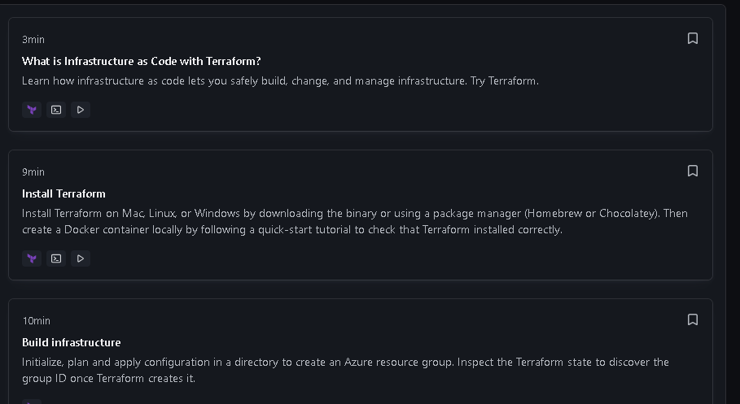
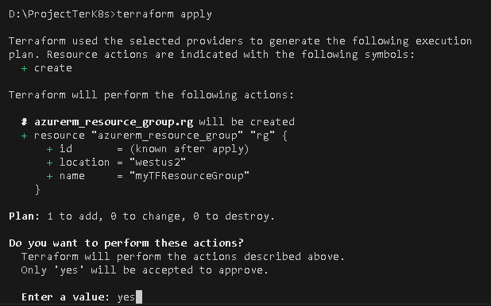
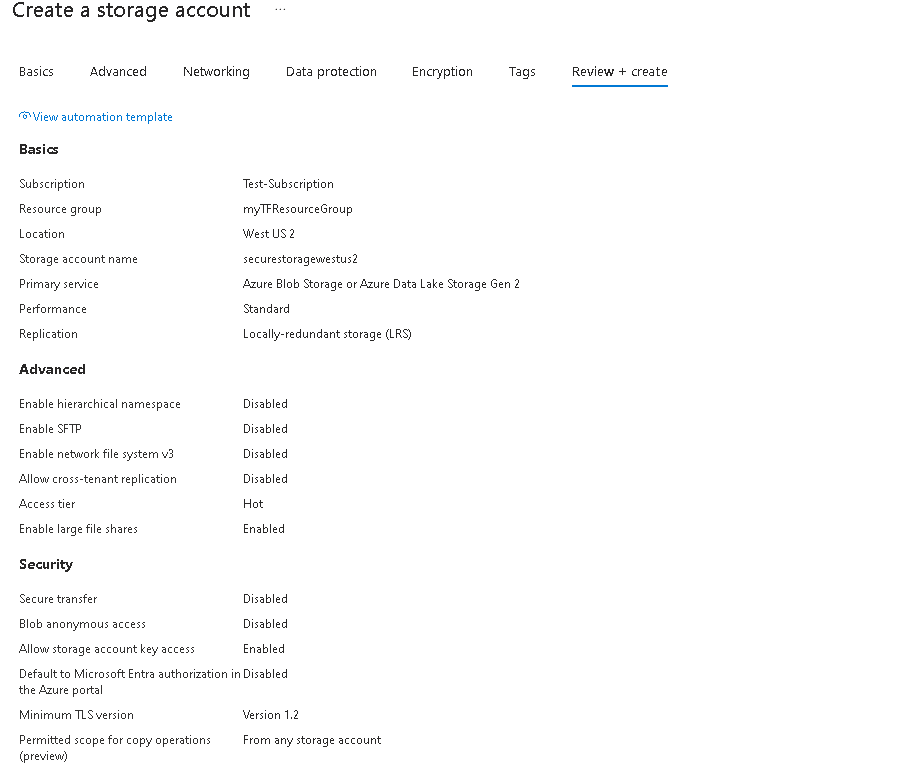
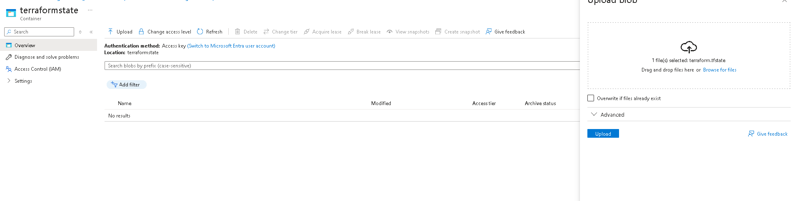
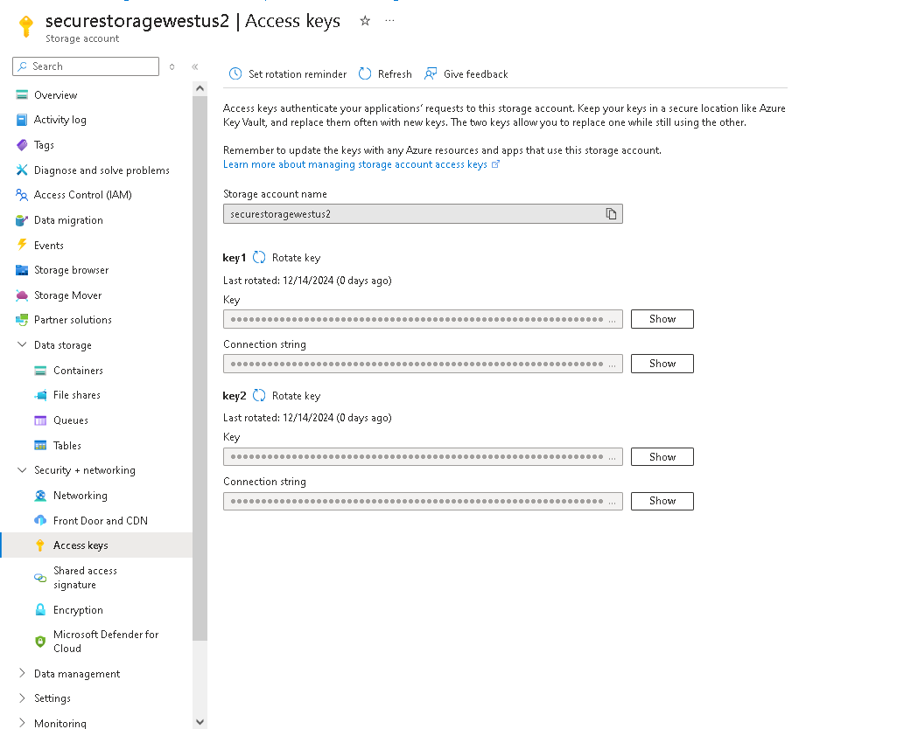

#  This file is a draft of the ideas that I will try to implement
####  In advance I can say it will be quite chaotic but the idea behind it is to have my idea "on paper"

---

- **Main task**
  - Terraform with AKS or other K8S solution ( Azure or AWS )
  - 2nodes with web app running
  - Preferably with split modules in teraform for easier management

- **Extra Task that I have set up for myself**

  - Use flask or django as app to run, make it interactive
  - Make diagram using recently founded diagram website, that was planned on for my main job by supporting complex architechtures in Azure

[diagram website](https://app.diagrams.net/)

---
<h1>How I am going on with this task</h1>
<h3>Practice with Teraform only</h3>

I started of with quick reminder

[Quick overview](https://www.youtube.com/watch?v=lIaUz2GAqEQ)

Then I wanted to learn more about the question that I lacked knowledge of in the interview process of how actually teraform makes the difference on what to change, what is provisioned - The State files and their use and connection in the big scheme. (to do: rewatch when I got stuck with the official doc or when I want to make it more interactive - video like)

[More in depth how it works](https://www.youtube.com/watch?v=UDmpeumiZ0g)

The above videos were more like warm up, since I myself try not to depend on youtube videos since technology is quickly developed, new updates, new ways of doing and youtube videos can not catch up as fast as the official documentation can.

Next stop is official learn documentation
The idea here is to go through these modules:

[official docs](https://developer.hashicorp.com/terraform/tutorials/azure-get-started)

Stumbeled accross the problem that I got old version of terraform,
so basically removing the old version from the PATH env on my Windows Machine and adding the new exe file there. Downloading with 

>"choco install terraform"
or i just ran

>"choco upgade terraform"
followed by 
>"terraform -v"
Okay successfully went from Terraform v1.5.0 to Terraform v1.10.2

Next step is to remind myself how to init a git repo and the commands since this markdown file is in the folder that I want to be in the repository.

checked my Git version
>"git --version"

Ran

>"choco upgrade git"

Went from git version 2.41.0.windows.1 to  git version 2.47.1.windows.1

After upgrading the Git version as well with *choco*, I reminded what myself what commands to use to make the currect folder connected with the Github repo that I created named **ProjectTerK8s**

1. git init
2. git add .
3. git commit -m"message"
4. git remote add origin <the http link generated in my repo>
5. git push -u origin master

Now after making sure that I got my repo and latest versions, following upon with the **Build infrastructure**

[Basic deploy of resource group with terraform](https://developer.hashicorp.com/terraform/tutorials/azure-get-started/azure-build)

With the CMD opened in my project folder 
>"az login"

got prompted on the browser to log in

Afterwards to select a subscription with 
>"az account list --all"

Since I got multiple tenants selecting one to log in 
>"az login --tenant <Tenant_ID>"

After selecting the tenant, selecting the subscription

>"az account set --subscription 'sub_id' "

but in order to view them in the CLI :

> az account list --output table

then selecting the subscription.

Next step is creating Service Principal thus giving Terraform  the needed rights and permissions to make changes to my Cloud Env.

>az ad sp create-for-rbac --role="Contributor" --scopes="/subscriptions/<SUBSCRIPTION_ID>"

Since dealing with sensitive info, I am investigating on how to do it properly and not have it publically viewable in my repo.

**coffee break**

okay so after running the command I got generated sensitive info that will be used by terraform, I am setting it up locally as environments on my CMD and into my own seperate fil (yes, I preffer CMD rather than PWSH, I am having a little hard time following the tutorial from the doc since it is made for pwsh, but little tweaks and adjustments had to be made and everything is good)
the cmd command now :

>set ARM_CLIENT_ID=xxxxxxxx-xxxx-xxxx-xxxx-xxxxxxxxxxxx

>set ARM_CLIENT_SECRET=xxxxxxxxxxxxxxxxxxxx

>set ARM_SUBSCRIPTION_ID=xxxxxxxx-xxxx-xxxx-xxxx-xxxxxxxxxxxx

>set ARM_TENANT_ID=xxxxxxxx-xxxx-xxxx-xxxx-xxxxxxxxxxxx

Just added the main.tf file following the docs with a basic resource group, about to apply terraform init, followed by format as best practice terraform fmt and checking for syntactically valid config with terraform validate, finally terraform apply

Since terraform state is important file I will need to create gitignore and to create a way that is not local (on my pc, so that state can be accessed by others, after searching and with little help with AI, it seems I need to connect terraform to its own backend in this case azure storage account seems appropriate solution and it I need to create blob where the file will be)

Creating the Azure Storage account with the names that I specified in the backend block 
Manually creating it:

Created the container in the storage account and uploaded the state file:

Now back to the changes in my main.tf file where I refference the new backend that terraform will use.
Stumbeled upon on stupid mistake since ... okay I made storage account, inside it blob , then uploaded the file.. but how is it expected the backend block that I refferenced to have access to that? Well access key is the answer that took 15minutes of my time!
In the left side of the resource itself, under Security + networking tab, I copied one of the keys and pasted it in my backen blocks

Okay but now comes other consideration since up until now I was blabbering a lot in this notes.md file I need to make sure that when I apply the changes to the repo no sensitive info will be seen, i plan to make that happen by utilizing gitignore and variables in terraform : to create a file that holds the needed variables and to refference them and the file itself  to add to gitignore

Created a variable in the secrets.tfvars that uses the key's value then that variable is called in the main.tf file  bu such:

variable "access_key" {}

(i hope i remember the syntax of all of these since it is quite extensive information to be obtained for one day)
After running git status I can see the files with sensitive info are no longer present in the output.