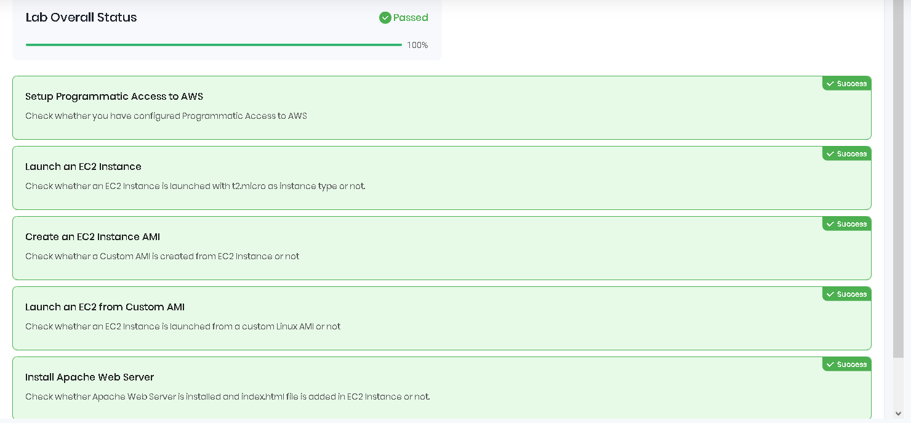

#  This file is a draft of the ideas that I will try to implement
####  In advance I can say it will be quite chaotic but the idea behind it is to have my idea "on paper"

---

- **Main task**
  - Terraform with AKS or other K8S solution ( Azure or AWS )
  - 2nodes with web app running
  - Preferably with split modules in teraform for easier management


- **Extra Task that I have set up for myself**

  - Use flask or django as app to run, make it interactive
  - Make diagram using recently founded diagram website, that was planned on for my main job by supporting complex architechtures in Azure

[diagram website](https://app.diagrams.net/)


---
<h1>How I am going on with this task</h1>
<h3>Practice with Teraform only</h3>

I started of with quick reminder

[Quick overview](https://www.youtube.com/watch?v=lIaUz2GAqEQ)

Then I wanted to learn more about the question that I lacked knowledge of in the interview process of how actually teraform makes the difference on what to change, what is provisioned - The State files and their use and connection in the big scheme. (to do: rewatch when I got stuck with the official doc or when I want to make it more interactive - video like)

[More in depth how it works](https://www.youtube.com/watch?v=UDmpeumiZ0g)

The above videos were more like warm up, since I myself try not to depend on youtube videos since technology is quickly developed, new updates, new ways of doing and youtube videos can not catch up as fast as the official documentation can.

Next stop is official learn documentation
The idea here is to go through these modules:


[official docs](https://developer.hashicorp.com/terraform/tutorials/azure-get-started)

Stumbeled accross the problem that I got old version of terraform,
so basically removing the old version from the PATH env on my Windows Machine and adding the new exe file there. Downloading with 

>"choco install terraform"
or i just ran

>"choco upgade terraform"
followed by 
>"terraform -v"
Okay successfully went from Terraform v1.5.0 to Terraform v1.10.2

Next step is to remind myself how to init a git repo and the commands since this markdown file is in the folder that I want to be in the repository.

checked my Git version
>"git --version"

Ran

>"choco upgrade git"

Went from git version 2.41.0.windows.1 to  git version 2.47.1.windows.1

After upgrading the Git version as well with *choco*, I reminded what myself what commands to use to make the currect folder connected with the Github repo that I created named **ProjectTerK8s**

1. git init
2. git add .
3. git commit -m"message"
4. git remote add origin <the http link generated in my repo>
5. git push -u origin master


Now after making sure that I got my repo and latest versions, following upon with the **Build infrastructure**

[Basic deploy of resource group with terraform](https://developer.hashicorp.com/terraform/tutorials/azure-get-started/azure-build)

With the CMD opened in my project folder 
>"az login"

got prompted on the browser to log in

Afterwards to select a subscription with 
>"az account list --all"

Since I got multiple tenants selecting one to log in 
>"az login --tenant <Tenant_ID>"

After selecting the tenant, selecting the subscription

>"az account set --subscription 'sub_id' "

but in order to view them in the CLI :

> az account list --output table

then selecting the subscription.

Next step is creating Service Principal thus giving Terraform  the needed rights and permissions to make changes to my Cloud Env.

>az ad sp create-for-rbac --role="Contributor" --scopes="/subscriptions/<SUBSCRIPTION_ID>"

Since dealing with sensitive info, I am investigating on how to do it properly and not have it publically viewable in my repo.

**coffee break**

okay so after running the command I got generated sensitive info that will be used by terraform, I am setting it up locally as environments on my CMD and into my own seperate fil (yes, I preffer CMD rather than PWSH, I am having a little hard time following the tutorial from the doc since it is made for pwsh, but little tweaks and adjustments had to be made and everything is good)
the cmd command now :

>set ARM_CLIENT_ID=xxxxxxxx-xxxx-xxxx-xxxx-xxxxxxxxxxxx

>set ARM_CLIENT_SECRET=xxxxxxxxxxxxxxxxxxxx

>set ARM_SUBSCRIPTION_ID=xxxxxxxx-xxxx-xxxx-xxxx-xxxxxxxxxxxx

>set ARM_TENANT_ID=xxxxxxxx-xxxx-xxxx-xxxx-xxxxxxxxxxxx


Just added the main.tf file following the docs with a basic resource group, about to apply terraform init, followed by format as best practice terraform fmt and checking for syntactically valid config with terraform validate, finally terraform apply


Since terraform state is important file I will need to create gitignore and to create a way that is not local (on my pc, so that state can be accessed by others, after searching and with little help with AI, it seems I need to connect terraform to its own backend in this case azure storage account seems appropriate solution and it I need to create blob where the file will be)

Creating the Azure Storage account with the names that I specified in the backend block 
Manually creating it:


Created the container in the storage account and uploaded the state file:


Now back to the changes in my main.tf file where I refference the new backend that terraform will use.
Stumbeled upon on stupid mistake since ... okay I made storage account, inside it blob , then uploaded the file.. but how is it expected the backend block that I refferenced to have access to that? Well access key is the answer that took 15minutes of my time!
In the left side of the resource itself, under Security + networking tab, I copied one of the keys and pasted it in my backen blocks


Okay but now comes other consideration since up until now I was blabbering a lot in this notes.md file I need to make sure that when I apply the changes to the repo no sensitive info will be seen, i plan to make that happen by utilizing gitignore and variables in terraform : to create a file that holds the needed variables and to refference them and the file itself  to add to gitignore

Created a variable in the secrets.tfvars that uses the key's value then that variable is called in the main.tf file  bu such:

variable "access_key" {}

(i hope i remember the syntax of all of these since it is quite extensive information to be obtained for one day)
After running git status I can see the files with sensitive info are no longer present in the output.

Stumbled on a block that after I applied and pushed the changes the old version of the file notes.md was observed which was strategy.md and it showed it was updated 4h ago.. working towards understanding this problem.

I refreshed and everything seems okay now? Like they say in support roles sometimes all you need is to restart the service.. I guess..


! https://developer.hashicorp.com/terraform/language/backend
To read more about configuring custom backend for terraform to save its state file


[X] Extra step that I decided to make before going into searching for docs on how to deploy AKS clusters in Hashicorp official docs or Microsoft Learn, of course I used ChatGPT, but in a manner that navigates me to the different components rather than giving me solution, along doing so I learned about online k8s playground
I plan to play around with it so I get used to the commands before moving into provisioning AKS.

You can find more info about this side quest bellow 

---
---
---

# online k8s playground

Knowledge generated by AI that i will test out, before provisioning AKS with terraform

### Kubernetes Learning Guide for Playgrounds

#### 1. **What is Kubernetes?**
Kubernetes (K8s) is an open-source platform for container orchestration. It allows you to deploy, scale, and manage containerized applications.

#### 2. **Basic Concepts in Kubernetes:**
- **Pods**: Smallest deployable unit. Contains one or more containers.
- **Nodes**: Worker machines where containers run.
- **Deployments**: Describes desired state of your application.
- **Services**: Expose your application (ClusterIP, NodePort, LoadBalancer).
- **Namespaces**: Logical separation of resources in a cluster.

#### 3. **Basic kubectl Commands:**
1. **Check Cluster Status:**
   ```bash
   kubectl get nodes
   ```

2. **Create a Deployment:**
   ```bash
   kubectl create deployment my-app --image=nginx
   ```

3. **Expose the Deployment:**
   ```bash
   kubectl expose deployment my-app --port=80 --type=NodePort
   ```

4. **Check Pods:**
   ```bash
   kubectl get pods
   ```

5. **Access the Application:**
   - Get the NodePort:
     ```bash
     kubectl get service my-app
     ```
   - Use the IP and NodePort to access the app in your browser.

6. **Delete the Deployment and Service:**
   ```bash
   kubectl delete deployment my-app
   kubectl delete service my-app
   ```

#### 4. **YAML Basics (for Kubernetes Configurations):**
```yaml
apiVersion: apps/v1
kind: Deployment
metadata:
  name: my-deployment
spec:
  replicas: 2
  selector:
    matchLabels:
      app: my-app
  template:
    metadata:
      labels:
        app: my-app
    spec:
      containers:
      - name: nginx-container
        image: nginx:latest
        ports:
        - containerPort: 80
```
This file creates a deployment for an `nginx` container with 2 replicas.

#### 5. **Accessing the Playground Online**
Use all these commands and YAML configurations in the online Kubernetes playground environment (e.g., [labs.play-with-k8s.com](https://labs.play-with-k8s.com/)).

#### 6. **Key Concepts to Learn**
- Understand basic `kubectl` commands.
- Practice creating Deployments and Services.
- Deploy a simple web application like `nginx`.
- Expose the application using `NodePort` or `LoadBalancer`.
- Modify and delete resources to observe behavior.


After trying to run minikube for the sake of learning the basics of Kubernetees, I encountered numerous erros,
one of which beeing that I need to enable virtualization support in my Bios settings, which I did, but still faced the same issue.
https://github.com/kubernetes/minikube/issues/3900
I found the above article and now I am trying to run this command with this flag:
minikube start --no-vtx-check
For now it still in loading phase, pop up saying that it will use VirtualBox interface came up, currently at 
Creating virtualbox VM (CPUs=2, Memory=6000MB, Disk=20000MB) ...

Now encountered the error:
! StartHost failed, but will try again: creating host: create: precreate: VirtualBox is configured with multiple host-only adapters with the same name "HostInterfaceNetworking-VirtualBox Host-Only Ethernet Adapter #2". Please remove one

removed the adapters from the Network settings of Virtual Box but without success.
Since I lost again my little dedicated time will continue tomorrow.

Since facing a lot of technical difficulties while trying to install minikube on my system and
later learning that is heavy on the system itself, I decided to try with the other alternative which
is KIND ( Kubernetees In Docker).
From what I have learn it makes clusters on containers, hence Docker Desktop (the windows version for running containers)
must be installed.

While trying to download Docker For desktop, I ran into the following error:

After further investigation I can see that this happends when WSL 2 or Hyper-V is not enabled on the system as well as WSL 2

Found PWSH (priviliged)command for enabling Hyper-V:
>"dism.exe /online /enable-feature /featurename:Microsoft-Hyper-V-All /all /norestart
"
And the PWSH (priviliged) command for enabling WSL 2:
>"dism.exe /online /enable-feature /featurename:VirtualMachinePlatform /all /norestart

>"dism.exe /online /enable-feature /featurename:WindowsSubsystemForLinux /all /norestart
"

After that I issued an restart on my PC

While waiting the installer going to check the logs
at %TEMP%  [WIN+R]

No relevant logs found.
Came up with the idea to install version 4.37
The same error.

Found offical docs related to this error:
https://forums.docker.com/t/unable-to-install-docker-desktop-4-8-2-component-communityinstaller-enablefeaturesaction-failed-not-found/124882

Bottom line issue may be related to Windows Management Instrumentation (WMI) repository corruption issues

1.Running priviliged CMD prompt
>"winmgmt /verifyrepository
"
It is WMI repository is consistent so I guess it is fine..

So the issue seems unrelated to WMI corruption, also checked the CPU tab on my Task Manager
Virtualization is indeed enabled.

Checked Windows Features, both Hyper-V and WSL are enabled.

Opened cmd where I got the docker installer and ran this command
>"start /w "" "Docker Desktop Installer.exe" install"

Unchecking the Hyper-V option in Windows Features, restarting and checking it again.

Tried everything I could get my hands on, because I am giving to much time into this error, I will try tomorrow to start KIND from WSL


Future self, since you may be wondering what happend at this milestone, yet I have deployed
Azure Storage Account and managed to use it as backend for terraform and version controll all of that, while trying to learn more
about k8s locally I faced certain problems, and while trying to fix them I faced even more problems.
In the end I ended up buying Hasrhicorp Certified Terraform Associate priparation by wizlabs
Doing videos,labs, sandboxes while making learnining in  interesting manner .
The plan is to open my VirtualBox and try k8s via Linux VM


I had concern about the course being tied to AWS infrastructure but I reminded myself that
the concepts are basically almost the same 
As they say with one bullet two rabbits, I can't wait to absorb new knowledge but at the same time
I gotta do it in timely manner since my day-to-day job is quite "CPU" demanding as well.


--
22.12.2024

First lab, preparing for Terraform Associate Exam


And since I allocated time as well to learn Terraform and K8s, I opened up
my Virtual Box, with Bridge Connection as networking Option one of my Kali Linux VMs
about to install docker and other dependencies and see if I will still face issues, as I did
on my Host OS which is Windows

# Installing Docker

sudo apt update && sudo apt install docker.io -y

# Ensure Docker is running

sudo systemctl start docker
sudo systemctl enable docker
docker --version

Worth mentioning I allocated 11 RAM for the machine to ensure it has the needed requirements for running 
docker and k8s


# Installing Kubernetes tools (kubectl, kubeadm, kubelet)

sudo apt-get update
sudo apt-get install -y apt-transport-https ca-certificates curl

Download the GPG key and save it to /usr/share/keyrings:
sudo curl -fsSLo /usr/share/keyrings/kubernetes-archive-keyring.gpg https://packages.cloud.google.com/apt/doc/apt-key.gpg

Add the Kubernetes repository to your system:
echo "deb [signed-by=/usr/share/keyrings/kubernetes-archive-keyring.gpg] https://apt.kubernetes.io/ kubernetes-xenial main" | sudo tee /etc/apt/sources.list.d/kubernetes.list


*yes I got navigated by ChatGPT for some of the commands since long time no see Linux CLI..*

Since when trying to install k8s tools they can not find the repo , had to re-add the repository and confirm it:
echo "deb [signed-by=/usr/share/keyrings/kubernetes-archive-keyring.gpg] https://apt.kubernetes.io/ kubernetes-xenial main" | sudo tee /etc/apt/sources.list.d/kubernetes.list

Also ensure the GPG Key is properly installed
sudo curl -fsSLo /usr/share/keyrings/kubernetes-archive-keyring.gpg https://packages.cloud.google.com/apt/doc/apt-key.gpg

and finally update my package cache 
sudo apt-get update

Which got the output 

Hit:1 http://http.kali.org/kali kali-rolling InRelease
Ign:4 https://download.docker.com/linux/debian kali-rolling InRelease
Err:5 https://download.docker.com/linux/debian kali-rolling Release
  404  Not Found [IP: 18.165.61.84 443]
Hit:2 https://packages.microsoft.com/repos/code stable InRelease
Ign:3 https://packages.cloud.google.com/apt kubernetes-xenial InRelease
Err:6 https://packages.cloud.google.com/apt kubernetes-xenial Release
  404  Not Found [IP: 142.251.140.14 443]
Reading package lists... Done
E: The repository 'https://download.docker.com/linux/debian kali-rolling Release' does not have a Release file.
N: Updating from such a repository can't be done securely, and is therefore disabled by default.
N: See apt-secure(8) manpage for repository creation and user configuration details.
E: The repository 'https://apt.kubernetes.io kubernetes-xenial Release' does not have a Release file.
N: Updating from such a repository can't be done securely, and is therefore disabled by default.
N: See apt-secure(8) manpage for repository creation and user configuration details.

After researching it appears that Docker repository does not have a kalli-rolling release file, but I can use the bullseye Debian 11
sudo nano /etc/apt/sources.list.d/docker.list

replaced it with
deb [arch=amd64] https://download.docker.com/linux/debian bullseye stable


Update the GPG Key for Docker: Download and add the GPG key for Docker:
sudo mkdir -p /etc/apt/keyrings

curl -fsSL https://download.docker.com/linux/debian/gpg | sudo gpg --dearmor -o /etc/apt/keyrings/docker.gpg

Again try To Update the Package cache
sudo apt-get update

Since it is getting again quite late I will try again when I have free time

Options that I see:
[ ] Try to troubleshoot and run docker and k8s on kali linux
[ ] Quickly Deploy linux distro and version that can run seemlessly those two