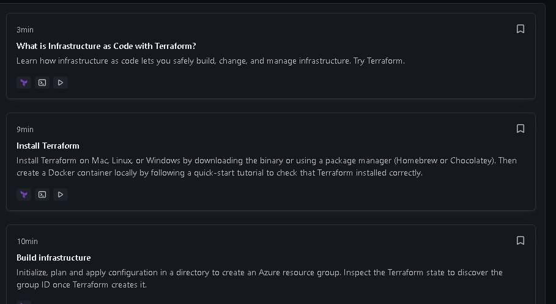

#  This file is a draft of the ideas that I will try to implement
####  In advance I can say it will be quite chaotic but the idea behind it is to have my idea "on paper"

---

- **Main task**
  - Terraform with AKS or other K8S solution ( Azure or AWS )
  - 2nodes with web app running
  - Preferably with split modules in teraform for easier management

- **Extra Task that I have set up for myself**

  - Use flask or django as app to run, make it interactive
  - Make diagram using recently founded diagram website, that was planned on for my main job by supporting complex architechtures in Azure

[diagram website](https://app.diagrams.net/)

---
<h1>How I am going on with this task</h1>
<h3>Practice with Teraform only</h3>

I started of with quick reminder

[Quick overview](https://www.youtube.com/watch?v=lIaUz2GAqEQ)

Then I wanted to learn more about the question that I lacked knowledge of in the interview process of how actually teraform makes the difference on what to change, what is provisioned - The State files and their use and connection in the big scheme. (to do: rewatch when I got stuck with the official doc or when I want to make it more interactive - video like)

[More in depth how it works](https://www.youtube.com/watch?v=UDmpeumiZ0g)

The above videos were more like warm up, since I myself try not to depend on youtube videos since technology is quickly developed, new updates, new ways of doing and youtube videos can not catch up as fast as the official documentation can.

Next stop is official learn documentation
The idea here is to go through these modules:

[official docs](https://developer.hashicorp.com/terraform/tutorials/azure-get-started)

Stumbeled accross the problem that I got old version of terraform,
so basically removing the old version from the PATH env on my Windows Machine and adding the new exe file there. Downloading with 

>"choco install terraform"
or i just ran

>"choco upgade terraform"
followed by 
>"terraform -v"
Okay successfully went from Terraform v1.5.0 to Terraform v1.10.2

Next step is to remind myself how to init a git repo and the commands since this markdown file is in the folder that I want to be in the repository.

checked my Git version
>"git --version"

Ran

>"choco upgrade git"

Went from git version 2.41.0.windows.1 to  git version 2.47.1.windows.1

